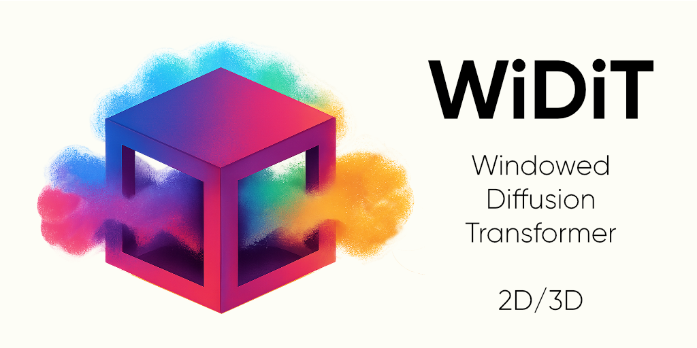

.. WiDiT documentation master file, created by
   sphinx-quickstart on Tue Mar 15 16:05:31 2022.
   You can adapt this file completely to your liking, but it should at least
   contain the root `toctree` directive.

.. include:: ../README.rst
   :start-after: start-badges
   :end-before: end-badges

WiDiT: Windowed Diffusion Transformer (2D/3D)

.. toctree::
   :maxdepth: 2
   :caption: Contents:

   quickstart
   credits

Indices and tables
==================

* :ref:`genindex`
* :ref:`modindex`
* :ref:`search`
